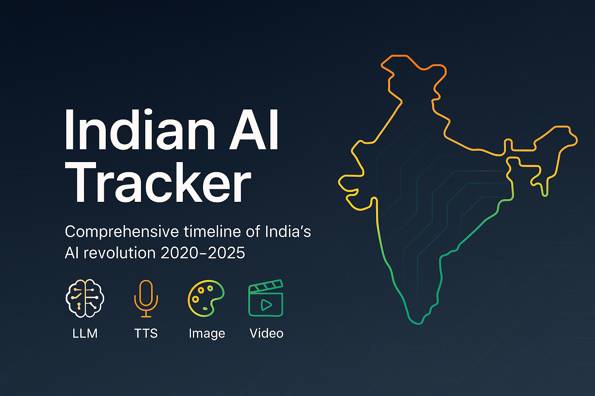

# 🇮🇳 Indian AI Tracker



> **Comprehensive timeline of India's AI revolution (2020-2025)**

A beautifully designed, interactive web application tracking the evolution of Indian artificial intelligence, featuring **20+ Large Language Models**, **8+ Text-to-Speech models**, **2+ Image Generation models**, and **2+ Video Generation models** across **20+ organizations**.

## 🌟 Live Demo

🔗 **[Visit Indian AI Tracker](https://traceback.in/)**

## 📋 Table of Contents

- [Features](#-features)
- [Tech Stack](#-tech-stack)
- [Installation](#-installation)
- [Usage](#-usage)
- [Project Structure](#-project-structure)
- [SEO Optimizations](#-seo-optimizations)
- [Contributing](#-contributing)
- [Timeline Coverage](#-timeline-coverage)
- [Organizations Tracked](#-organizations-tracked)
- [License](#-license)

## ✨ Features

### 🎯 Core Features

- **Interactive Timeline**: Chronological view of Indian AI milestones from 2020-2025
- **Advanced Filtering**: Filter by year, AI model type (LLM, TTS, Image, Video)
- **Organization Profiles**: Detailed information about 20+ Indian AI organizations
- **Progress Dashboard**: Visual analytics and insights
- **Real-time Search**: Search across organizations, models, and descriptions
- **Mobile Responsive**: Optimized for all devices and screen sizes

### 🔍 Content Categories

- **🧠 Large Language Models (LLMs)**: IndicBERT, Krutrim, BharatGPT, Sarvam AI models
- **🎤 Text-to-Speech (TTS)**: Bulbul, AI4Bharat TTS, C-DAC GIST systems
- **🎨 Image Generation**: BharatDiffusion, Kalaido.ai
- **🎬 Video Generation**: Chitralekha, BharatGPT Video

### 🚀 Technical Features

- **SEO Optimized**: Complete meta tags, structured data, sitemap
- **Performance Optimized**: Fast loading, mobile-first design
- **Accessibility**: WCAG compliant, screen reader friendly
- **Progressive Enhancement**: Works without JavaScript

## 🛠️ Tech Stack

### Frontend

- **React 18** - Modern React with hooks
- **TypeScript** - Type-safe development
- **Vite** - Fast build tool and dev server
- **Tailwind CSS** - Utility-first CSS framework

### UI Components

- **Shadcn/ui** - Modern React component library
- **Lucide React** - Beautiful icon library
- **Radix UI** - Accessible component primitives

### State Management & Data

- **TanStack Query** - Server state management
- **React Router** - Client-side routing
- **Custom Hooks** - Reusable logic

### Development Tools

- **ESLint** - Code linting
- **PostCSS** - CSS processing
- **TypeScript** - Static type checking

## 🚀 Installation

### Prerequisites

- **Node.js** 18+
- **npm** or **yarn** or **bun**

### Quick Start

```bash
# Clone the repository
git clone https://github.com/enough-jainil/india-ai-tracker-hub.git
cd india-ai-tracker-hub

# Install dependencies
npm install
# or
yarn install
# or
bun install

# Start development server
npm run dev
# or
yarn dev
# or
bun dev

# Open http://localhost:5173 in your browser
```

### Build for Production

```bash
# Build the application
npm run build
# or
yarn build
# or
bun run build

# Preview production build
npm run preview
# or
yarn preview
# or
bun run preview
```

## 📖 Usage

### Navigation

1. **Timeline View**: Browse chronological AI developments
2. **Organizations**: Explore detailed company profiles
3. **Dashboard**: View analytics and progress metrics

### Filtering & Search

- Use **year filters** to focus on specific time periods
- Apply **category filters** to see only LLMs, TTS, Image, or Video models
- **Search bar** finds organizations, models, and descriptions instantly

### Interactive Features

- Click on timeline events to expand detailed information
- Filter combinations for precise exploration
- Mobile-optimized touch interactions

## 📁 Project Structure

```
indian-ai-tracker/
├── public/
│   ├── sitemap.xml          # SEO sitemap
│   ├── robots.txt           # Search engine directives
│   └── favicon.ico          # Site favicon
├── src/
│   ├── components/
│   │   ├── ui/              # Reusable UI components
│   │   ├── InteractiveTimeline.tsx
│   │   ├── CompanyProfiles.tsx
│   │   └── ProgressDashboard.tsx
│   ├── hooks/               # Custom React hooks
│   ├── lib/                 # Utility functions
│   ├── pages/
│   │   ├── Index.tsx        # Main page component
│   │   └── NotFound.tsx     # 404 page
│   ├── App.tsx              # Root application component
│   ├── main.tsx             # Application entry point
│   └── index.css            # Global styles
├── index.html               # HTML template with SEO meta
├── package.json             # Dependencies and scripts
├── tailwind.config.ts       # Tailwind configuration
├── tsconfig.json            # TypeScript configuration
└── vite.config.ts           # Vite configuration
```

## 🔍 SEO Optimizations

### Meta Tags & Social Sharing

- **Complete meta tags** for search engines
- **Open Graph** tags for Facebook/LinkedIn sharing
- **Twitter Cards** for Twitter sharing
- **Structured data** (JSON-LD) for rich snippets

### Technical SEO

- **XML Sitemap** (`/sitemap.xml`)
- **Robots.txt** with proper directives
- **Canonical URLs** to prevent duplicate content
- **Mobile-first responsive design**
- **Fast loading** with optimized assets

### Content SEO

- **Semantic HTML** structure
- **Proper heading hierarchy** (H1 → H2 → H3)
- **Alt text ready** for images
- **Search-friendly URLs**

## 📊 Timeline Coverage

### 🗓️ Years Tracked

- **2020-2025**: Complete timeline of Indian AI evolution
- **Real-time updates**: Latest developments added regularly

### 📈 Model Categories

| Category  | Count | Examples                                |
| --------- | ----- | --------------------------------------- |
| **LLMs**  | 20+   | Krutrim, BharatGPT, Sarvam-1, IndicBERT |
| **TTS**   | 8+    | Bulbul, AI4Bharat TTS, C-DAC GIST       |
| **Image** | 2+    | BharatDiffusion, Kalaido.ai             |
| **Video** | 2+    | Chitralekha, BharatGPT Video            |

## 🏢 Organizations Tracked

### Leading Companies & Institutions

- **Krutrim Lab** (Ola's AI subsidiary)
- **Sarvam AI** (India's AI unicorn)
- **AI4Bharat** (IIT Madras initiative)
- **CoRover.ai** (BharatGPT creators)
- **Tech Mahindra** (Project Indus)
- **IIT Bombay & Reliance Jio** (Hanooman AI)
- **Government of India** (Bhashini Platform)
- **C-DAC** (Hindi TTS systems)
- **Fractal** (Kalaido.ai)
- **Yellow.ai** (YellowG)
- **Zoho Corporation** (Domain LLMs)
- ...and many more!

## 🤝 Contributing

We welcome contributions! Here's how you can help:

### 📝 Content Contributions

- **Add new AI models** or organizations
- **Update existing information**
- **Improve descriptions** and details
- **Suggest new features**

### 🔧 Technical Contributions

- **Bug fixes** and improvements
- **Performance optimizations**
- **New features** and components
- **Documentation** improvements

### Getting Started

1. **Fork** the repository
2. **Create** a feature branch (`git checkout -b feature/amazing-feature`)
3. **Commit** your changes (`git commit -m 'Add amazing feature'`)
4. **Push** to the branch (`git push origin feature/amazing-feature`)
5. **Open** a Pull Request

### 📋 Contribution Guidelines

- Follow the existing code style and conventions
- Add TypeScript types for new components
- Update documentation for new features
- Test on multiple devices and browsers
- Follow semantic commit message format

## 📄 License

This project is licensed under the **MIT License** - see the [LICENSE](LICENSE) file for details.

## 🙏 Acknowledgments

- **AI4Bharat** for pioneering Indian language AI research
- **All the organizations** building India's AI ecosystem
- **Open source community** for amazing tools and libraries
- **Contributors** who help improve this project

## 📞 Contact & Support

- **Website**: [https://traceback.in/](https://traceback.in/)
- **Issues**: [GitHub Issues](https://github.com/enough-jainil/india-ai-tracker-hub/issues)
- **Discussions**: [GitHub Discussions](https://github.com/enough-jainil/india-ai-tracker-hub/discussions)
- **X (Twitter)**: [@algogist](https://x.com/algogist)

---

<div align="center">

**Made with ❤️ for India's AI community**

⭐ **Star this repo** if you find it useful!

</div>
